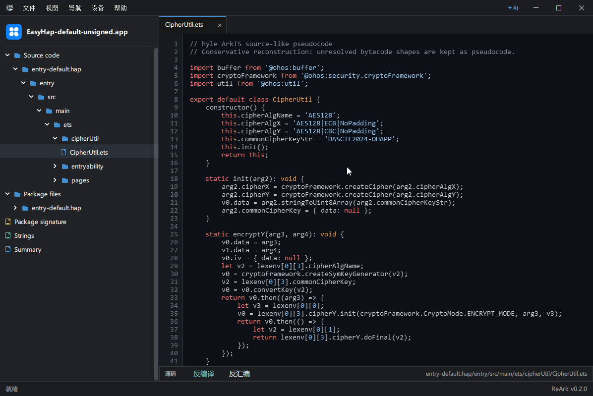
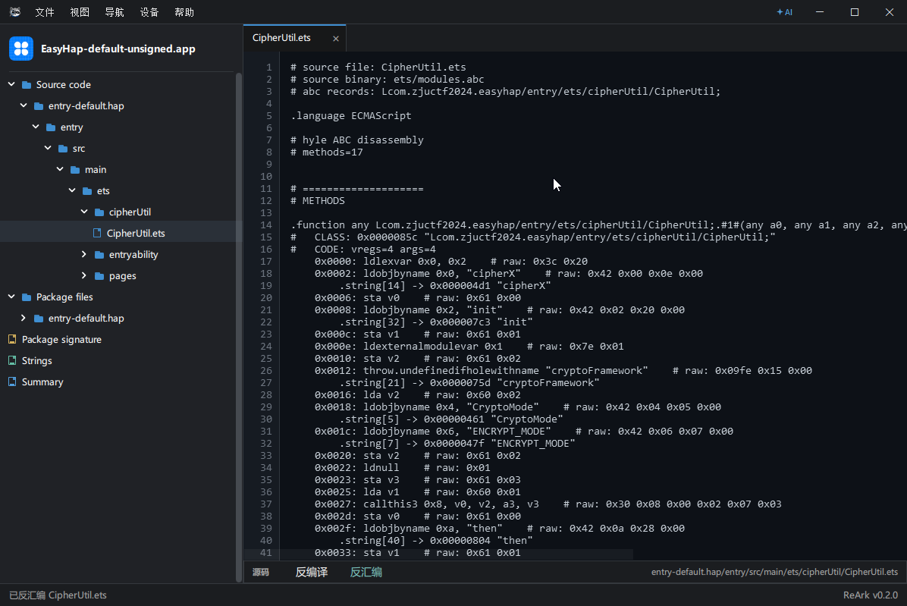
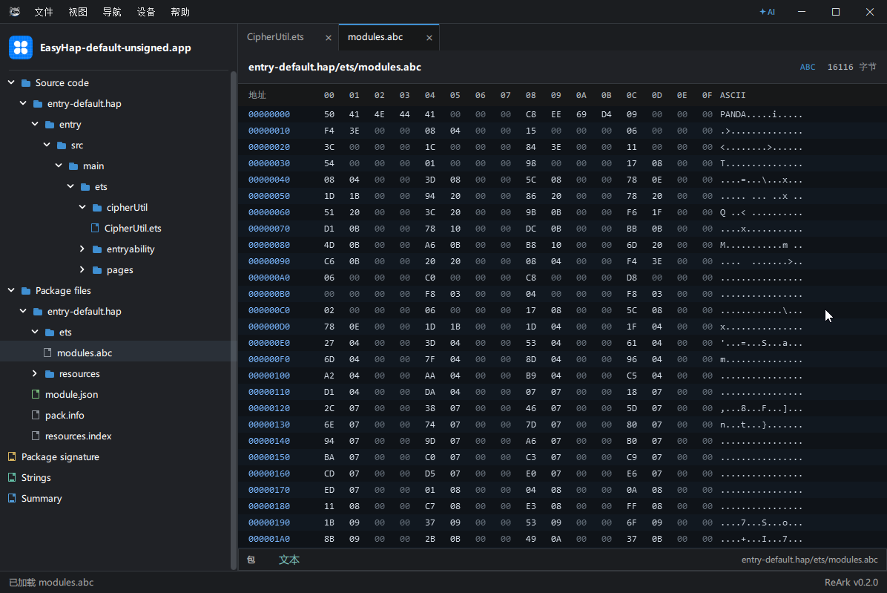
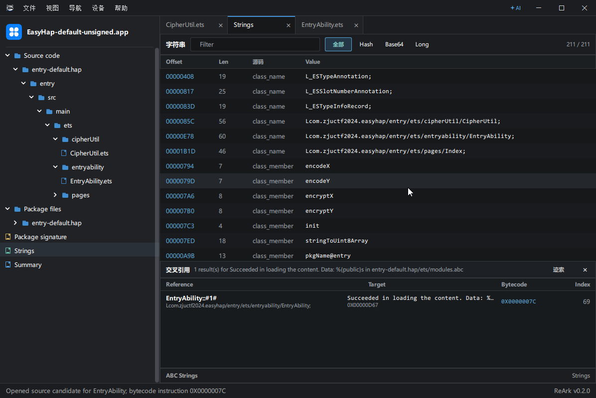
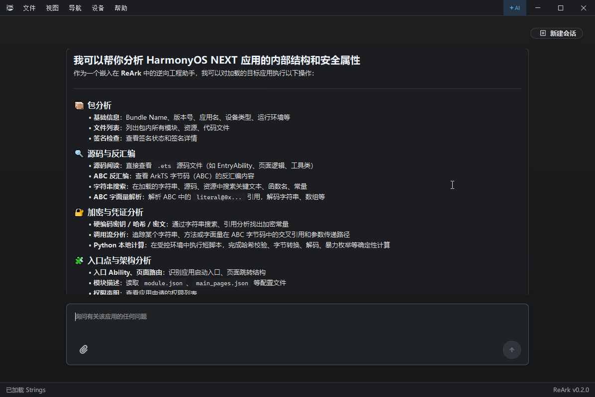
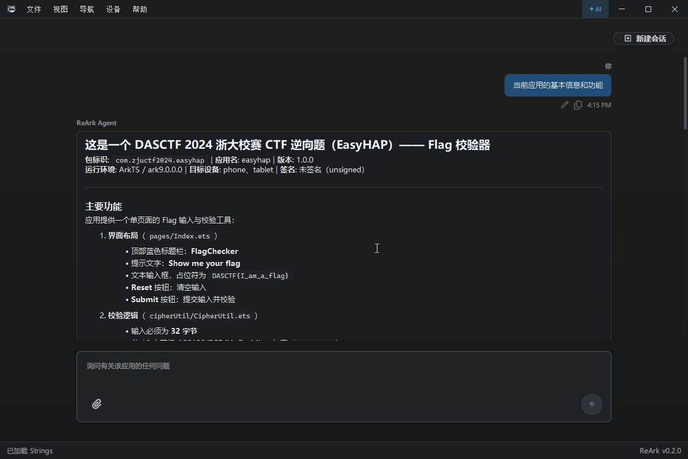
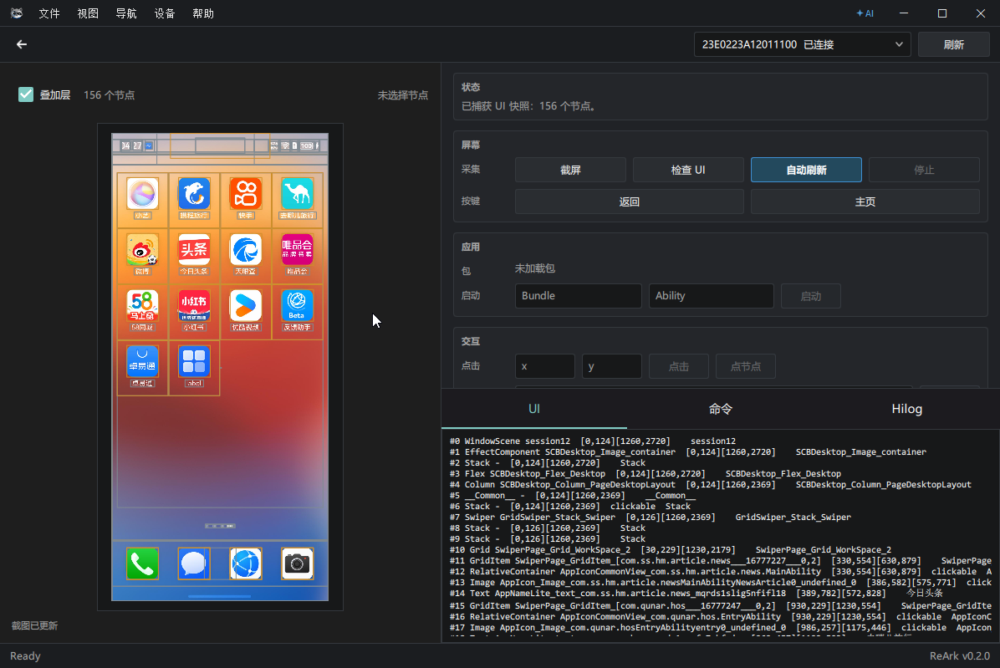
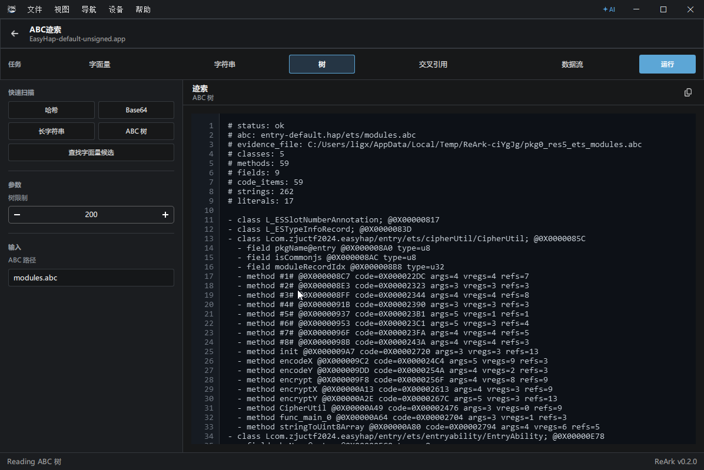

# ReArk

English | [简体中文](README.zh-CN.md)

ReArk is a professional reverse engineering tool for HarmonyOS NEXT applications. It analyzes `.hap`, `.app`, and `.abc` files, with support for disassembly, decompilation, string analysis, cross-references, signature inspection, re-signing, package browsing, repackaging, application metadata, Agent-assisted analysis, device interaction, and evidence trace analysis.

ReArk lowers the barrier to HarmonyOS application analysis. Use it to review app security, work through HarmonyOS CTF challenges, reverse application logic, automate interactions on HarmonyOS devices, inspect runtime logs, and build your own analysis workflow.

## Installation

Download and run:

[ReArk-0.2.0-windows-x64-setup.exe](https://github.com/lkimuk/ReArk/releases/download/v0.2.0/ReArk-0.2.0-windows-x64-setup.exe)

## Feature Highlights

**Package Analysis**

- Supports HarmonyOS NEXT `.hap`, `.app`, and `.abc` files
- Browse package structure, modules, generated source output, resources, signatures, and metadata
- Inspect signatures and certificate information
- Search files and quickly open important paths from the package tree

**Static Analysis**

- View Ark bytecode disassembly and decompiled source in package context
- Inspect ABC strings, hex content, formatted JSON, text, images, and media resources
- Use ABC evidence views to trace bytecode references, constants, and related code paths
- Keep analysis grounded in real package clues with less note juggling and context switching

**ReArk Agent**

- Ask contextual questions about the currently opened package
- Let the Agent inspect package metadata, files, strings, disassembly, and decompiled output when needed
- Use provider presets for OpenRouter, OpenAI, OpenAI-compatible endpoints, Anthropic, Gemini, Ollama, DeepSeek, DashScope, and Qwen
- Attach reference documents to enrich AI-assisted analysis with your own notes and materials
- Drive a full analysis flow across static review, device installation, launch verification, and log tracing

**Device Connection**

- Discover connected HarmonyOS devices
- Install the current application to a device
- Capture screenshots, inspect UI nodes, and connect UI evidence to the real device state
- Read Hilog output and perform basic UI actions such as tap, text input, Back, Home, and swipe

## Screenshots

| Workspace overview | Ark disassembly |
| --- | --- |
|  |  |

| ABC / Hex inspection | Strings |
| --- | --- |
|  |  |

| ReArk Agent | Agent analysis |
| --- | --- |
|  |  |

| Device runtime | ABC evidence |
| --- | --- |
|  |  |

## Safety and Privacy

Use ReArk only for legally authorized reverse engineering, interoperability research, malware analysis, and security research.

When using ReArk Agent with remote model providers, avoid submitting secrets, certificates, user data, trade secrets, or other sensitive content.

## License

ReArk is licensed under the Apache License 2.0. See [LICENSE](LICENSE) for details.

Third-party notices are listed in [THIRD_PARTY_NOTICES.md](THIRD_PARTY_NOTICES.md).

## Support

- Issues: [GitHub Issues](https://github.com/lkimuk/ReArk/issues)
- User guide: [cppmore.com/ReArk](https://www.cppmore.com/category/ReArk/)
